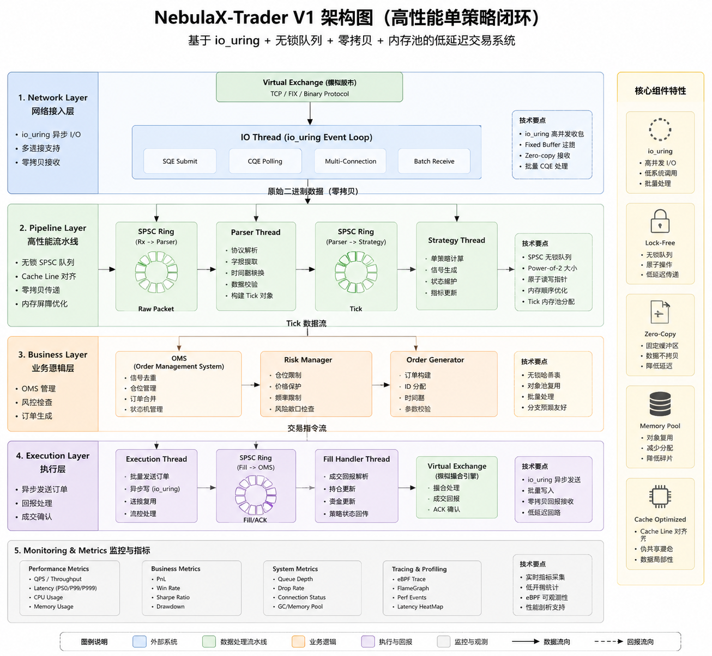

# NebulaX-Trader

High Performance Low Latency Trading Infrastructure

## 项目简介

NebulaX-Trader 是一个基于 C++ 构建的低延迟量化交易基础设施项目。

项目目标是探索现代交易系统中的高性能架构设计，包括：

- 高性能行情接入；
- Tick 数据处理流水线；
- 多策略交易架构；
- 低延迟订单执行；
- 无锁数据通信；
- 零拷贝数据处理；
- 网络与硬件级性能优化。


该项目关注交易系统基础设施性能，而非复杂交易策略。

核心目标：

> 在保持交易业务逻辑稳定的情况下，通过不断优化底层架构，提高系统吞吐能力并降低尾延迟。


---

# 项目背景

现代量化交易系统通常需要同时满足：

- 高吞吐 Tick 处理；
- 微秒级延迟响应；
- 稳定的尾延迟；
- 多策略并行运行；
- 高可靠订单执行。


NebulaX-Trader 希望通过工程实践探索完整交易链路中的性能优化。


---

# 核心设计方向

## 高性能网络

计划支持：

- io_uring 异步网络模型；
- 高并发行情接入；
- 后续 Kernel Bypass 网络优化。


## 无锁数据通路

使用：

- Lock-free Ring Buffer；
- SPSC / SPMC 数据结构；
- 高效线程间通信。


目标：

降低线程同步开销，提高数据处理效率。


## 零拷贝数据处理

减少：

- Tick 数据复制；
- 内存重新分配；
- 不必要的数据转换。


提升：

- Cache 利用率；
- 数据处理效率。


## 多策略交易架构

支持多个策略同时消费 Tick：

- 趋势策略；
- 动量策略；
- 均值回归策略。


重点研究：

- Tick 广播；
- 多消费者管理；
- 数据共享。


---

# 项目整体架构

## 目标架构


## V1 架构




---

# 项目目录结构

```
NebulaX-Trader
├── main.cpp                              # 程序主入口
├── CMakeLists.txt
├── README.md
├── .gitignore
├── LICENSE
├── .github/
│   └── workflows/
│       └── ci.yml                        # CI 配置（GitHub Actions）
├── config/
│   └── default.yaml                      # 默认全局配置（YAML）
├── docs/
│   ├── VERSION_PLAN.md                   # 版本规划
│   ├── MARKET_DATA_DECISION.md           # Tick 数据源选型决策
│   ├── PACKET_LOSS_NOTES.md             # 补包机制思考记录
│   ├── design/                           # 详细设计文档
│   │   └── .gitkeep
│   ├── benchmark/                        # 性能测试报告
│   │   └── trader_benchmark_usage.md      # 压测客户端使用说明
│   └── images/
│       ├── V1架构图.png
│       └── 目标架构图.png
├── scripts/                              # 工具脚本
│   └── .gitkeep
├── core/
│   ├── types.h                           # 核心数据结构（Tick / Order）
│   ├── config.h                          # 配置结构体定义
│   ├── config_loader.cpp                 # YAML 配置解析器
│   ├── memory/
│   │   └── memory_pool.h                # 内存池
│   ├── queue/
│   │   ├── spsc_byte_ring.h              # SPSC 无锁环形队列（迁移自 NebulaX）
│   │   └── spmc_ring.h                   # SPMC 无锁环形队列
│   ├── net/
│   │   ├── i_market_data_receiver.h       # 行情接收抽象层（IMarketDataReceiver）
│   │   └── io_uring_receiver.h            # io_uring 后端实现（V1 默认）
│   ├── ipc/
│   │   └── flow_control.h                # 压测流量控制共享内存
│   └── utils/
│       └── align.h                       # Cache line 对齐工具
├── market/
│   ├── gateway/
│   │   └── market_data_gateway.h         # 行情网关（基于 IMarketDataReceiver）
│   └── parser/
│       └── tick_parser.h                 # Tick 解析器
├── strategy/
│   ├── base/
│   │   └── strategy.h                   # 策略基类
│   ├── momentum/
│   │   └── momentum_strategy.h          # 动量策略
│   └── trend/
│       └── trend_strategy.h             # 趋势跟踪策略
├── oms/
│   ├── order.h                          # 订单状态枚举
│   └── order_manager.h                  # 订单管理器（生命周期）
├── risk/
│   └── risk_manager.h                   # 风险控制器（仓位/风控校验）
├── execution/
│   └── execution_engine.h               # 执行引擎（订单路由 + 算法执行）
├── benchmark/
│   └── main.cpp                         # 性能测试入口
└── tests/
    ├── unit/
    │   ├── test_spsc.cpp                # SPSC 单元测试
    │   └── test_spmc.cpp                # SPMC 单元测试
    └── integration/
        └── test_tick_pipeline.cpp       # 全链路流水线集成测试
```


## 目录说明

### core

系统基础组件。

包括：

- 无锁队列（SPSC / SPMC）；
- 内存池；
- 通用工具；
- 配置管理（YAML 驱动）；


---

### market

行情处理模块。

负责：

- 行情接入（UDP 原始二进制流）；
- ITCH/STEP/LWSP 协议解析；
- 高性能网络接入（io_uring）。


---

### strategy

策略模块。

负责：

- Tick消费；
- 信号计算；
- 买卖决策。


策略仅用于验证系统架构。

---

### oms

Order Management System。

负责：

- 策略信号管理；
- 订单生成；
- 订单生命周期维护。


---

### risk

风险控制模块。

负责：

- 仓位限制；
- 订单检查；
- 风险规则。


---

### execution

执行模块。

负责：

- 订单发送；
- 成交处理；
- 执行状态维护。


---

### benchmark

性能测试模块。

用于测试：

- Tick吞吐；
- 延迟；
- P99/P999；
- CPU性能。


---

### tests

测试代码。

包括：

- 单元测试；
- 数据结构测试；
- 性能测试。


---

# 开发计划

项目采用渐进式版本开发，详见 `docs/VERSION_PLAN.md`。


各版本内容：

- V1：单线程交易闭环（io_uring，Benchmark 基线）
- V2：并行 Pipeline（SPMC / 多连接）
- V3：多策略平台（Strategy Manager / 风控）
- V4：网络接收层抽象（IMarketDataReceiver + AF_XDP）
- V5：L2 真实行情接入（上证/深证 UDP 原始流）
- V6：DPDK 高性能网络后端（三种后端 Benchmark）


---

# 性能指标

项目主要关注：

| 指标 | 描述 |
|----|----|
| Throughput | Tick处理吞吐 |
| Latency | 单次处理延迟 |
| P99 | 尾延迟 |
| P999 | 极端延迟 |
| CPU Usage | CPU资源利用 |
| Cache Miss | 硬件性能指标 |


性能测试记录：

见 `docs/benchmark/`


---

# 技术栈

## 语言

- C++20


## 构建

- CMake


## 平台

- Linux


## 性能工具

- perf
- FlameGraph
- eBPF


## 网络

- io_uring
- (Future) DPDK


---

# 关联项目

[NebulaX](https://github.com/2250127831/NebulaX) — High Performance Matching Engine


---

# License

MIT License。详见 LICENSE 文件。
