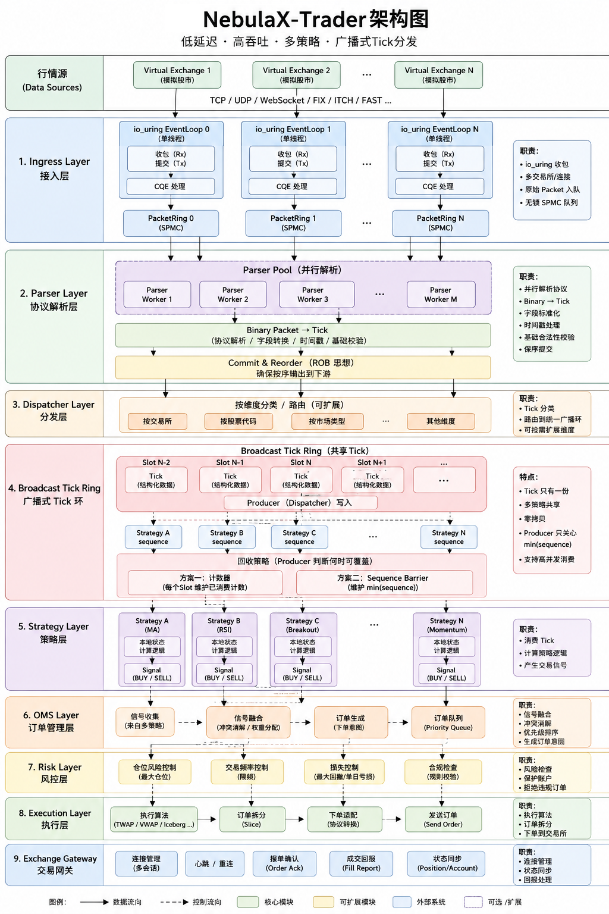

# NebulaX-Trader Version Plan

## 项目最终目标

NebulaX-Trader 是一个面向低延迟量化交易场景的高性能交易基础设施项目。

项目目标是构建一个接近真实机构交易系统的数据处理与交易执行框架，重点研究：

- 高性能行情接入；
- 低延迟 Tick 数据处理；
- 多策略并行计算；
- 高效订单管理；
- 风控与执行链路；
- 极限网络性能优化。

最终系统形态：



项目核心原则：

> 保持交易业务流程稳定，通过底层基础设施持续优化，提高系统吞吐和降低尾延迟。

---

# 总体演进路线

项目有两条独立演进线：

**业务架构线**：V1 单线程 → V2 并行 Pipeline → V3 多策略平台 → V5 L2 真实行情
**网络基础设施线**：V1(io_uring) → V4(AF_XDP) → V6(DPDK)

```
V1
单线程交易闭环（io_uring · IMarketDataReceiver 起点）
  │
  ├── V2：并行 Pipeline（SPMC / 多连接 / Parser Pool）
  │     │
  │     └── V3：多策略平台（Strategy Manager / 广播 / 风控）
  │           │
  │           └── V5：L2 真实行情接入（上证/深证 UDP）
  │                 │      走 AF_XDP 通道，验证真实数据下的延迟
  │                 │
  │                 └── 新增协议解析层，业务代码不改
  │
  ├── V4：AF_XDP 网络后端（新增 AF_XDPReceiver，业务代码不改）
  │
  └── V6：DPDK 网络后端（三种 IMarketDataReceiver 后端对比）
```

---

# V1 — 单线程交易闭环

## 目标

基于 NebulaX 已验证的高性能组件，构建完整的单线程交易链路。

从 V1 开始引入 `IMarketDataReceiver` 抽象层，默认实现为 `IoUringReceiver`。后续新增网络后端时上游业务代码无需修改。

## 架构

```
Virtual Exchange
        │
        ▼
IMarketDataReceiver ← IoUringReceiver（V1 默认实现）
        │
        ▼
Parser → Market State → Dispatcher → Strategy → OMS → Execution
```

## 主要内容

迁移并整合已有技术：
- io_uring 异步网络；
- 无锁 RingBuffer（SPSC）；
- Zero-copy 数据传输；
- Memory Pool / Object Pool；
- Cache Line 优化。

实现：
- 行情接收；
- Tick 解析；
- 策略计算；
- 订单生成；
- 模拟执行。

形成完整但高性能的单策略交易链路，作为全链路的 Benchmark 基线。

## 预期提升

相比传统交易模型：
- 同步 IO → 异步 IO；
- 普通队列 → 无锁队列；
- 动态内存分配 → 对象池管理；
- 减少数据复制。

---

# V2 — 并行 Pipeline

## 目标

解决高频 Tick 输入下的吞吐瓶颈。

## 主要内容

新增：
- 多连接支持；
- SPMC / MPMC 无锁队列；
- Parser Worker Pool（并行解析）；
- Dispatcher 分发层。

实现：
- 原始 Tick 并行解析；
- Binary Protocol 解析；
- Tick 结构化转换；
- 顺序提交。

## 相比 V1 的提升

- 从单线程解析升级为多消费者并行；
- 提高多核 CPU 利用率；
- 降低高吞吐场景下的延迟抖动。

---

# V3 — 多策略平台

## 目标

支持多个策略同时消费 Tick，向真实量化平台靠近。

## 主要内容

新增：
- Strategy Manager（策略注册与生命周期管理）；
- Tick Broadcast Ring（多策略广播）；
- Consumer Sequence 管理；
- Market State 维护；
- 风控模块集成。

策略（仅用于验证系统）：
- 趋势策略；
- 动量策略；
- 均值回归策略。

## 相比 V2 的提升

- 单策略 → 多策略；
- 降低多策略场景的数据复制成本；
- 提高系统扩展能力。

---

# V4 — AF_XDP 网络后端

## 目标

新增 `AF_XDPReceiver` 作为 `IMarketDataReceiver` 的第二个实现。

Parser、Dispatcher、Strategy 等所有业务代码**一行不改**。

## 主要内容

- 实现 `AF_XDPReceiver`（基于 AF_XDP 的零拷贝网络后端）；
- 在模拟行情源下对比 io_uring 和 AF_XDP 的延迟差异。

## 相比 V3 的提升

- 进一步降低网络路径延迟；
- 验证接收层抽象的有效性。

---

# V5 — L2 真实行情接入

## 目标

接上证/深证 L2 原始 UDP 行情流，在 V4 的 AF_XDP 通道上跑真实数据。

## 主要内容

- 对接上证/深证 L2 行情协议（逐笔成交、逐笔委托、快照）；
- 基于 AF_XDP 通道接收原始 UDP 多播流；
- 解析落地，与模拟行情做延迟对比。

## 相比 V4 的提升

- 从模拟/ITCH 协议切换到真实 L2 行情；
- 验证 AF_XDP 在真实 UDP 多播流下的性能；
- 获取真实市场环境下的延迟基线数据。

---

# V6 — DPDK 网络后端

## 目标

引入 DPDK，`IMarketDataReceiver` 家族完整，做三种后端的横向 Benchmark。

## 主要内容

- 新增 `DPDKReceiver`（基于 DPDK 的用户态网卡驱动）；
- 完整后端家族：

```
IMarketDataReceiver
        ▲
  ┌─────┼──────┐
  │     │      │
io_uring AF_XDP DPDK
（V1） （V4） （V6）
```

## 对比测试

同一套业务代码、同一份 L2 行情数据，分别跑在三个后端上：
- Tick 接收延迟（P50 / P99 / P999）；
- 吞吐量；
- CPU 开销；
- Cache Miss。

## 相比 V5 的提升

- DPDK 完全绕过内核网络栈，极限低延迟；
- 三种后端的 benchmark 数据可量化每一层优化的实际收益。

---

# 贯穿：全链路可观测

所有版本都集成 LensX eBPF 探针，部署在以下关键节点：

| 探针 | 位置 | 测量内容 |
|:----:|:----|:---------|
| ① | IMarketDataReceiver 接收完成 | 数据从网卡到解析完成耗时 |
| ② | SPMC 写入完成 | 队列写入延迟 |
| ③ | Worker 读取 Tick | 消费延迟 |
| ④ | 策略信号发出 | 计算延迟 |
| ⑤ | 下单请求发出 | 执行引擎到网络发送延迟 |

每次优化后输出各节点的 P50 / P90 / P99 / P999 延迟分布，以及 CSV 原始数据。
